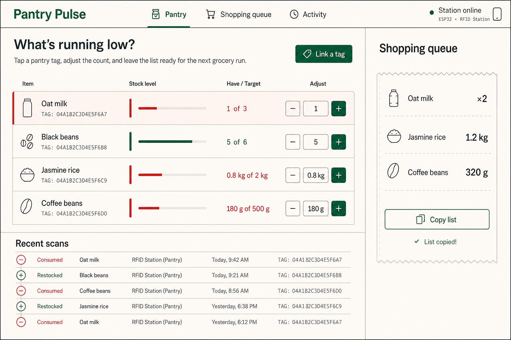

# Pantry Pulse

## A pantry that tells you what disappeared—and what to buy next.

[](https://github.com/aranlucas/pantry-pulse/actions/workflows/ci.yml)
[](LICENSE)

Pantry Pulse is a private RFID pantry station and inventory dashboard. Tap a tagged can or bag, choose consume or restock, and the station sends an idempotent event to a Cloudflare Worker. D1 keeps the household inventory and event history; the dashboard turns it into a calm shopping queue; guarded MCP tools let an assistant read or update the pantry.

The repository contains the Worker, Vite/React dashboard, D1 schema and seed data, and reference firmware for an ESP32 DevKit with an MFRC522 reader. It is designed for a household deployment rather than a hosted multi-tenant service.



_Concept artwork from `docs/design/`; it illustrates the intended station, not a screenshot of a running deployment._

## The useful loop

1. **Scan a tag.** The ESP32 station posts a consume or restock event to `POST /api/device/scans` with a stable event ID, so a retry cannot double-count a can.
2. **See the truth.** The dashboard shows stock, low-stock items, shopping needs, recent activity, and RFID/catalog links. Its admin token lives in the browser session only.
3. **Ask an assistant.** Read-only MCP clients can call `pantry_snapshot` or `shopping_queue_export`; a write-scoped token also enables `pantry_adjust` and `pantry_link_item`.
4. **Let it tidy up.** A daily scheduled Worker task prunes detailed inventory events while compact tombstones preserve idempotency for late hardware retries.

The admin API also supports snapshots, item creation, inventory adjustments, and tag/catalog links. `/health` checks the D1 binding. Device requests are rate limited.

### Linking and stock corrections

`POST /api/items/:id/link` changes only supplied metadata fields. Omitted fields are preserved; a `null` RFID or catalog field clears that link, while `null` `unit`, `target`, or `onHand` leaves the existing value unchanged. Catalog provider and item ID must form a complete pair after the update.

A non-null `onHand` is an absolute stock correction. Send `expectedQuantity` with the count the editor originally displayed to reject stale edits with `409 inventory_conflict`. If it is omitted, the command checks the count read when the request starts. The stock change, metadata, and inventory event commit together, or none do. On conflict, refresh the pantry and reopen the item before retrying. The dashboard sends a correction only when its on-hand field changed; MCP metadata linking never changes stock.

## Local development

Requirements:

- Node.js 24 or newer.
- pnpm 12.10.1 (`packageManager` in `package.json`). Cloudflare CLI (`cf`) and the Cloudflare Vite plugin are installed by the project.
- PlatformIO and an ESP32 DevKit with an MFRC522 reader only when working on firmware.

Install dependencies and create untracked local Worker credentials:

```bash
corepack enable
pnpm install --frozen-lockfile
cp .dev.vars.example .dev.vars
```

Replace every token in `.dev.vars` with a high-entropy value. Apply the local D1 migration and seed the sample pantry before starting both servers:

```bash
pnpm db:migrate:local
pnpm db:seed:local
pnpm dev
```

`pnpm dev` runs `cf dev`, which starts Vite with the Cloudflare plugin. Open the URL printed by the command (normally `http://127.0.0.1:5173`); the same server serves the dashboard and runs `/api`, `/health`, and `/mcp` in the Workers runtime. The dashboard asks for `ADMIN_TOKEN` from `.dev.vars`.

The Cloudflare plugin and local D1 scripts share `.cloudflare/state/`, configured with `persistState` in `vite.config.ts`. The scripts pass `--persist-to .cloudflare/state` because `cf` resource commands otherwise use a machine-wide state directory.

For a deployed D1 database, review the migration and run the remote commands explicitly:

```bash
pnpm db:migrate:remote
pnpm db:seed:remote
```

The remote commands require `pnpm cf auth login` or a `CLOUDFLARE_API_TOKEN` and operate on the database UUID declared in `cloudflare.config.ts`. `cf` D1 commands default to remote resources; the local scripts explicitly pass `--local`. If you provision a different database, update its ID in both the config and the database scripts in `package.json`.

## Firmware

The reference station is documented in [`firmware/esp32-rfid/README.md`](firmware/esp32-rfid/README.md). It uses an ESP32 DevKit, an MFRC522 over SPI, and a normally-open mode button. Copy `config.example.h` to `config.h`, fill in Wi-Fi, the Worker base URL and matching host, the device token, and the TLS root CA, then run:

```bash
cd firmware/esp32-rfid
cp config.example.h config.h
pio run
pio run --target upload
pio device monitor
```

The firmware keeps a bounded outbox in ESP32 NVS, retries transient failures with backoff, and reuses each event ID across retries. It does not log the bearer token. Nothing is flashed automatically by this repository or its CI workflows.

## Checks and deployment

```bash
pnpm format:check
pnpm lint
pnpm typecheck
pnpm cf-typegen:check
pnpm test
pnpm build
pnpm deploy
```

`pnpm check` runs formatting, linting, type checking, the full application build, and a deployment dry run. `pnpm test` runs the client and Worker Vitest suites; Worker tests load `cloudflare.config.ts`. `pnpm typecheck` regenerates binding and runtime types with `cf workers types` before checking the dashboard, Worker, tests, and tooling through the shared `tsconfig.json`. Generated declarations live in the ignored `.cloudflare/types/` directory, so CI generates them rather than committing them. Worker code uses the generated `Cloudflare.Env` type directly. `pnpm cf-typegen:check` is an alias for the full type check.

`pnpm build` runs `cf build` to package the Worker and dashboard together in `.cloudflare/output/`. `pnpm deploy` builds the application and deploys that output with `cf deploy --prebuilt --mode production`. Vite records the build mode, so prebuilt deployments must specify the same mode. To validate the built output without uploading anything, run `pnpm cf deploy --prebuilt --mode production --dry-run` after `pnpm build`.

The project uses the [Cloudflare CLI](https://developers.cloudflare.com/cf/) and Cloudflare Vite plugin 2.0 beta. `cloudflare.config.ts` owns Worker settings and bindings; `vite.config.ts` configures development and bundling. `cf` is currently in beta.

## Source map

| Path                                 | Responsibility                                                                            |
| ------------------------------------ | ----------------------------------------------------------------------------------------- |
| `src/worker.ts`                      | Worker entry point, security headers, `/health`, API/MCP dispatch, and scheduled pruning. |
| `src/server/http.ts`                 | Authenticated REST routes for the dashboard and device scans.                             |
| `src/server/repository.ts`           | D1 reads/writes, idempotent inventory events, snapshots, and retention.                   |
| `src/server/mcp.ts`                  | Read and write MCP tool registration and result schemas.                                  |
| `src/client/`                        | Vite/React dashboard, session token handling, inventory views, and API client.            |
| `migrations/` and `scripts/seed.sql` | D1 schema and optional local/remote sample data.                                          |
| `firmware/esp32-rfid/`               | PlatformIO firmware and wiring/configuration reference.                                   |
| `cloudflare.config.ts`               | Worker, D1, rate-limit, static asset, observability, and cron bindings.                   |

Design files under [`docs/design/`](docs/design/) are exploratory concepts and are labeled as such; they are not screenshots of a running deployment.

## Status and security

The Worker, dashboard, tests, D1 schema, MCP surface, and reference firmware are present. Hardware and Cloudflare resources still need to be provisioned by the operator. Keep `.dev.vars`, `config.h`, Wi-Fi credentials, TLS material, and all bearer tokens out of Git. See [`SECURITY.md`](SECURITY.md) for private vulnerability reporting and token responsibilities.
